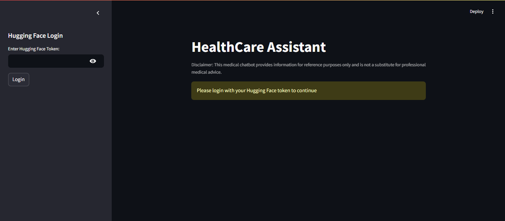
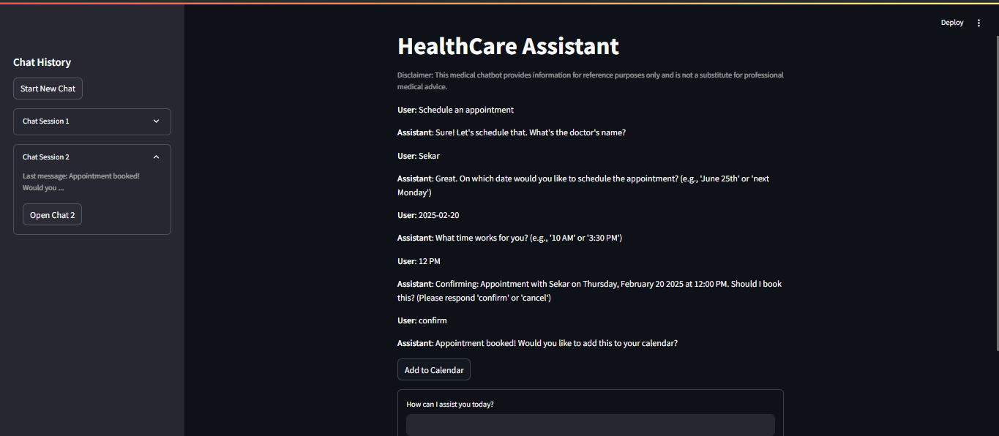
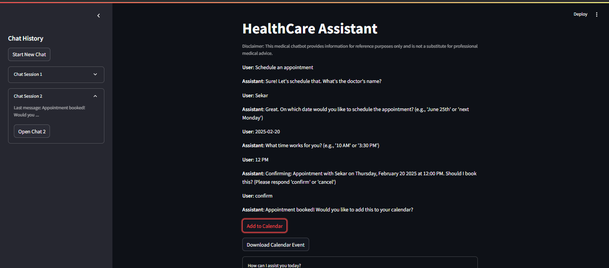

# HealthCare Assistant Chatbot

  
*A Medical Chatbot powered by Hugging Face Transformers*

## 🌟 Overview
The **HealthCare Assistant Chatbot** is an AI-powered chatbot designed to assist users with medical queries, symptoms, and doctor appointments. It leverages a state-of-the-art **biomedical language model** to generate informative responses and even allows **appointment scheduling** with calendar integration.

---
## ✨ Features

✔️ **AI-Powered Medical Assistance** – Provides healthcare-related information using a **Bio-Medical Llama-3-2-1B-CoT-012025** model.  
✔️ **Hugging Face Authentication** – Secure login to access the AI model.  
✔️ **Natural Language Understanding** – Recognizes user queries and provides relevant answers.  
✔️ **Appointment Booking** – Users can schedule, confirm, or cancel doctor appointments.  
✔️ **.ICS Calendar Integration** – Exports scheduled appointments to calendar (.ics file).  
✔️ **Chat History** – Maintain multiple chat sessions for a seamless experience.  
✔️ **User-Friendly UI** – Built with **Streamlit** for an intuitive user interface.  

---
## 🚀 Installation & Setup

### 1️⃣ Clone the Repository
```bash
$ git clone https://github.com/your-repo/healthcare-chatbot.git
$ cd healthcare-chatbot
```

### 2️⃣ Create a Virtual Environment (Optional but Recommended)
```bash
$ python -m venv venv
$ source venv/bin/activate  # On Windows use: venv\Scripts\activate
```

### 3️⃣ Install Dependencies
```bash
$ pip install -r requirements.txt
```

### 4️⃣ Get a Hugging Face Token
1. Go to **[Hugging Face](https://huggingface.co/join)** and sign up.
2. Navigate to **Settings → Access Tokens**.
3. Generate a **new token** with `read` access.
4. Use this token when prompted in the chatbot.

### 5️⃣ Run the Chatbot
```bash
$ streamlit run app.py
```

---
## 🏥 How It Works

### ✅ Authentication
Users need to enter their **Hugging Face Token** to access the AI model. Once logged in, they can chat with the assistant.

### 💬 Chat Functionality
- Users can ask **medical-related queries** and receive AI-generated responses.
- The chatbot understands **natural language inputs** and gives **context-aware replies**.
- It provides **doctor recommendations** based on symptoms.

### 📅 Appointment Booking
- Users can **schedule an appointment** by providing:
  - Doctor’s name
  - Preferred date and time
  - Confirmation of booking
- Appointments can be exported to a **.ICS calendar file** for reminders.

### 🛠️ Model Used
The chatbot is powered by **Bio-Medical Llama-3-2-1B-CoT-012025**, a transformer model fine-tuned for medical and biomedical NLP tasks.

---
## 📸 Screenshots
> Below are some screenshots of the chatbot UI, authentication, chat history, and appointment booking:





---
## 📌 Technologies Used
- **Streamlit** – For building the web UI.
- **Transformers (Hugging Face)** – For AI-powered responses.
- **Dateparser & iCalendar** – For appointment scheduling and calendar export.
- **PyTorch** – For optimized model inference.

---
## 📬 Contact
For any queries, feel free to reach out:  
📧 Email: dharunm236@gmail.com

_Disclaimer: This medical chatbot provides information for reference purposes only and is not a substitute for professional medical advice._

_Enjoy using the HealthCare Assistant! Stay healthy! 💙_

